# Exploration of Red Wine Composition
Fernando Maletski  
***
  This project aims to shed a light on how the chemical composition of a red wine affect it's quality, measured by a median sensory score from at least 3 wine tasting experts.


#### The dataset was provided by:

  P. Cortez, A. Cerdeira, F. Almeida, T. Matos and J. Reis. 
  Modeling wine preferences by data mining from physicochemical properties.
  In Decision Support Systems, Elsevier, 47(4):547-553. ISSN: 0167-9236.

  Available at: [@Elsevier] http://dx.doi.org/10.1016/j.dss.2009.05.016
                [Pre-press (pdf)] http://www3.dsi.uminho.pt/pcortez/winequality09.pdf
                [bib] http://www3.dsi.uminho.pt/pcortez/dss09.bib


***
# Univariate Plots Section

  Here we'll be taking a look at the various variables in the dataset, with a brief description, and histograms showing the count of data points.


### Dataset Dimentions


```
## [1] 1599   12
```

  We have 1599 data points with 12 variables.


### Dataset Structure


```
## 'data.frame':	1599 obs. of  12 variables:
##  $ fixed.acidity       : num  7.4 7.8 7.8 11.2 7.4 7.4 7.9 7.3 7.8 7.5 ...
##  $ volatile.acidity    : num  0.7 0.88 0.76 0.28 0.7 0.66 0.6 0.65 0.58 0.5 ...
##  $ citric.acid         : num  0 0 0.04 0.56 0 0 0.06 0 0.02 0.36 ...
##  $ residual.sugar      : num  1.9 2.6 2.3 1.9 1.9 1.8 1.6 1.2 2 6.1 ...
##  $ chlorides           : num  0.076 0.098 0.092 0.075 0.076 0.075 0.069 0.065 0.073 0.071 ...
##  $ free.sulfur.dioxide : num  11 25 15 17 11 13 15 15 9 17 ...
##  $ total.sulfur.dioxide: num  34 67 54 60 34 40 59 21 18 102 ...
##  $ density             : num  0.998 0.997 0.997 0.998 0.998 ...
##  $ pH                  : num  3.51 3.2 3.26 3.16 3.51 3.51 3.3 3.39 3.36 3.35 ...
##  $ sulphates           : num  0.56 0.68 0.65 0.58 0.56 0.56 0.46 0.47 0.57 0.8 ...
##  $ alcohol             : num  9.4 9.8 9.8 9.8 9.4 9.4 9.4 10 9.5 10.5 ...
##  $ quality             : int  5 5 5 6 5 5 5 7 7 5 ...
```

### Dataset Summary


```
##  fixed.acidity   volatile.acidity  citric.acid    residual.sugar  
##  Min.   : 4.60   Min.   :0.1200   Min.   :0.000   Min.   : 0.900  
##  1st Qu.: 7.10   1st Qu.:0.3900   1st Qu.:0.090   1st Qu.: 1.900  
##  Median : 7.90   Median :0.5200   Median :0.260   Median : 2.200  
##  Mean   : 8.32   Mean   :0.5278   Mean   :0.271   Mean   : 2.539  
##  3rd Qu.: 9.20   3rd Qu.:0.6400   3rd Qu.:0.420   3rd Qu.: 2.600  
##  Max.   :15.90   Max.   :1.5800   Max.   :1.000   Max.   :15.500  
##    chlorides       free.sulfur.dioxide total.sulfur.dioxide
##  Min.   :0.01200   Min.   : 1.00       Min.   :  6.00      
##  1st Qu.:0.07000   1st Qu.: 7.00       1st Qu.: 22.00      
##  Median :0.07900   Median :14.00       Median : 38.00      
##  Mean   :0.08747   Mean   :15.87       Mean   : 46.47      
##  3rd Qu.:0.09000   3rd Qu.:21.00       3rd Qu.: 62.00      
##  Max.   :0.61100   Max.   :72.00       Max.   :289.00      
##     density             pH          sulphates         alcohol     
##  Min.   :0.9901   Min.   :2.740   Min.   :0.3300   Min.   : 8.40  
##  1st Qu.:0.9956   1st Qu.:3.210   1st Qu.:0.5500   1st Qu.: 9.50  
##  Median :0.9968   Median :3.310   Median :0.6200   Median :10.20  
##  Mean   :0.9967   Mean   :3.311   Mean   :0.6581   Mean   :10.42  
##  3rd Qu.:0.9978   3rd Qu.:3.400   3rd Qu.:0.7300   3rd Qu.:11.10  
##  Max.   :1.0037   Max.   :4.010   Max.   :2.0000   Max.   :14.90  
##     quality     
##  Min.   :3.000  
##  1st Qu.:5.000  
##  Median :6.000  
##  Mean   :5.636  
##  3rd Qu.:6.000  
##  Max.   :8.000
```

### Output variable, quality

  Quality was measured by at least 3 wine experts who graded each wine using a score that goes from 0 (very bad) to 10 (very excellent). The value present in the dataset is the median of those scores.
  
  As we can see in the summary above, the quality scores in the dataset actually ranges from 3 to 8.

<!-- -->

  As we can see in the summary above and on the plot, the quality scores in the dataset actually ranges from 3 to 8, normally distributed, with most scores ranging from 5 to 7, there is no decimal value.

### Fixed Acidity

  The quantity, in grams per liter (g/dm^3), of nonvolatile acids.
  
  
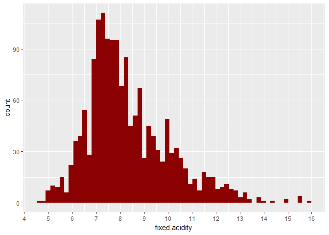<!-- -->

  Again we have a normally distributed variable, but this time, there's a few outliers (values above 13.5), with a mode at around 7.5.
  
### Volatile Acidity

  The amount of acetic acid, in grams per liter (g/dm^3). This acid in high quantities lead to the unpleasant, vinegar taste found in some wines.
  
<!-- -->

  Most wines have between 0.3 and 0.8 grams per liter, with very few above the 1.0 mark. It's a bi modal normal distribution with 0.4 and 0.6 as modes.

### Citric Acid

  Measured in grams per liter (g/dm^3). Present in small quantities, citric acid adds a "freshness" and citric flavor to the wine.

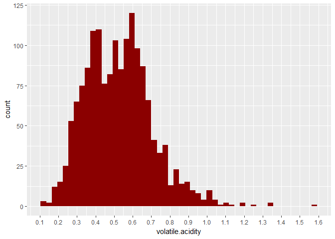<!-- -->

 We have a pretty even, slightly positively skewed distribution. Is of note, that there's 2 clear spikes, at 0 and around 0.5 grams per liter.
 
### Residual Sugar

  The quantity of sugar remaining after the fermentation stops, in grams per liter (g/dm^3). It's rare to find wines with less than 1 g/liter and above 45 they are considered "sweet".

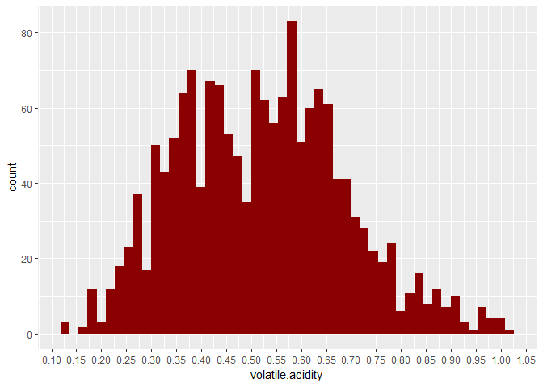<!-- -->

  Most wines have between 1 and 3 grams per liter. We have no "sweet" wines in our dataset.


```
## Warning: Removed 29 rows containing non-finite values (stat_bin).
```

<!-- -->
  
  Zooming in to between 0 and 7 we can see a high concentration of values between 1.5 and 2.5.
  
### Chlorides

  The amount of salt (sodium chloride), in grams per liter (g/dm^3).
  
<!-- -->

  Very few observations below 0.025 and above 0.125 grams per liter.
  

```
## Warning: Removed 67 rows containing non-finite values (stat_bin).
```

```
## Warning: Removed 1 rows containing missing values (geom_bar).
```

<!-- -->
  
  Discarding values above 0.15 we have a normal distribution with a mode at 0.075
  

### Free Sulfur Dioxide

  Free form SO2 exists in equilibrium between molecular SO2 (as a dissolved gas) and bisulfite ion. Prevents microbial growth and the oxidation of wine. But concentrations of over 50 ppm (roughly 50 mg/L, considering the density the same as water) becomes evident in the taste and the bouquet (smell) of the wine.
  
  Measured in milligrams per liter (mg/dm^3).

<!-- -->

  Very few exceed the 'taste threshold' of 50 ppm, but we can expect a great impact on the score of these wines. The distribution is negatively skewed.

### Total Sulfur Dioxide

  The total amount of SO2, free and bound in milligrams per liter (mg/dm^3). The impact on the score should be less evident than its free counterpart.

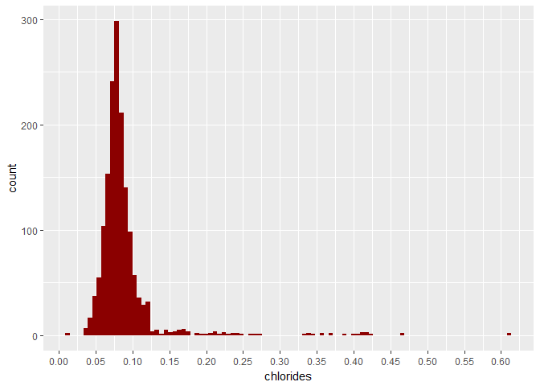<!-- -->

  Most data points have less than 120 mg/L. And we have a few outliers above the 270 mg/L mark. Again, we have a negatively skewed distribution.
  
### Density

  The density of the wine may be closer to that of water (1 kg/L) depending on the alcohol and sugar content. This variable is measured in kilograms per liter (kg/L)
  
<!-- -->
  
  The majority of wines are a little bit less dense than water (kg/L), but there is a few exceptions. Sugar tends to make the wine more dense and alcohol less dense. We will be using this variable, multiplied with the Free Sulfur Dioxide one to convert it to ppm so we can accurately compare it with the 50 ppm threshold from the dataset documentation:
  

```
##    Min. 1st Qu.  Median    Mean 3rd Qu.    Max. 
##  0.9973  6.9910 13.9100 15.8200 20.9900 71.8000
```

<!-- -->

  As expected, the plot is very similar, but using the correct units is important to not make hasty assumptions.
  
### pH

  pH is a very well known numeric scale to specify the acidity or basicity of a liquid. It usually ranges from 0 (very acidic) to 14 (very basic), but can exceed those values on extreme cases.
  
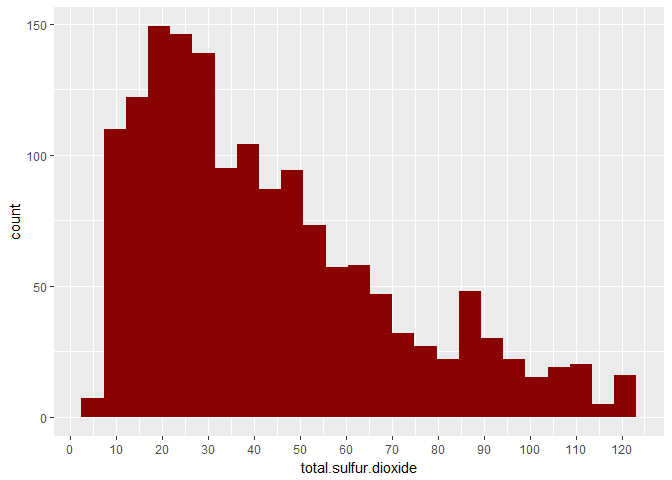<!-- -->

  We have a nice normal distribution with most wines between 3 and 3.6 on the pH scale.
  
### Sulphates

  Sulphates are wine additives that contribute to the sulfur dioxide (SO2) levels. SO2 is necessary because it acts as an antimicrobial and antioxidant, preserving the wine. This variable is in grams per liter (g/dm3)
  
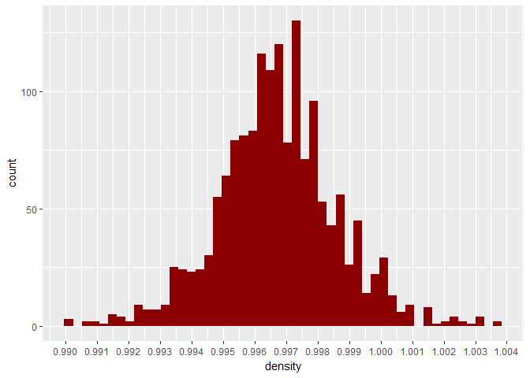<!-- -->

  Very few wines exceed the 1.2 g/L mark, they can be considered outliers. This variable is approximately normally distributed with the mode at 0.6 g/L.
  
### Alcohol

  And lastly, alcohol content in percent by volume.
  
<!-- -->

Very few wines have less than 9 % alcohol, the rest are in a negatively skewed distribution peaking at around 9.5 %.

### Wine Profile by Quality

  As we have very few wines of the best (18) and worst (10) quality available, it makes sense to expand the bins to include more scores:

```
## 
##   3   4   5   6   7   8 
##  10  53 681 638 199  18
```
  
  If we isolate the best (quality = 7 and 8) and worst (quality = 3 and 4) wines in our dataset we can have three profiles of wines:
  
* Worst wines: Quality = 3 and 4
* Average wines: Quality = 5 and 6
* Best wines: Quality = 7 and 8


```
## 
##   worst average    best 
##      63    1319     217
```

  A radar plot using those profiles can help us identify trends in the data. We'll be using the ppm (parts per million) version of the 'Free Sulfur Dioxide' variable:
  
<!-- -->

  As we have significant outliers in the following variables: sulphates, total sulfur dioxide, chlorides and residual sugar, taking the mean of all the variables in the groups and normalizing the results to between 0.5 ,for the lowest value, and 1.0, for the highest, can further help identifying the trends. It is important to say that doing so we lose some dimensionality information, but trends tend to be clearer:


<!-- -->
***

# Univariate Analysis

### What is the structure of your dataset?

There are 1599 red wines in the dataset with 12 variables, one of them, quality is the output variable, in other words, we will be trying to determine which variables have an effect, and which effect it is, in the quality of the wine. Preliminary analysis has the variables split in three different groups:

* Positive effect - Variables that tend to increase the quality of the wines as they increase, to a limit of course (we will study the outliers later on).
    + Fixed Acidity
    + Citric Acid
    + Sulphates
    + Alcohol
* Negative effect - Variables that tend to have the opposite effect, decreasing the quality of the wine as they increase:
    + Volatile Acidity
    + Chlorides
    + pH
* Undetermined effect - Variables that we can't classify still, maybe they have a more complicated relationship (for example, increasing the quality up until a certain value), further investigation is necessary:
    + Residual Sugar
    + Free Sulfur Dioxide (ppm)
    + Total Sulfur Dioxide
    + Density
  
Further investigation is necessary to confirm these hypothesis and to better understand the "Undetermined effect" variables.

Other observations:

* There is no "perfect wine", quality actually ranges between 3 and 8, with most wines scoring 5 and 6 (1319).
* Four variables have significant outliers:
    + Sulphates
    + Total Sulfur Dioxide
    + Chlorides
    + Residual Sugar
* With the exception of "Citric Acid", "Free Sulfur Dioxide", "Total Sulfur Dioxide" and "Alcohol", the variables tend to be normally distributed, or pretty close to it.
* "Free Sulfur Dioxide", "Total Sulfur Dioxide" and "Alcohol" are positively skewed.
* "Citric Acid" have a pretty even distribution, a bit positively skewed. There is 2 pronounced spikes at 0 and around 0.5.

### What is/are the main feature(s) of interest in your dataset?

The main feature is quality. This exploration objective is to determine how and which other variables have an effect on it. Choosing the right variables, i suspect a linear model could be created to predict the quality based on the remaining variables.

### What other features in the dataset do you think will help support your investigation into your feature(s) of interest?

  As stated in the first question, all the variables seems to have an effect on quality, albeit differently, there are variables with positive, negative and yet undetermined effects. Further investigation is necessary to confirm this hypothesis and to clarify the undetermined variables.

  One point of interest that needs a deeper analysis is the relationship between variables. For example, in the documentation of the dataset is stated that sugar and alcohol have an effect on density, so it is important in investigate if density can be treated as an independent variable as is necessary to use it on a linear model (regression). The same can be said to sulphates, free and total sulfur dioxide.
  
### Did you create any new variables from existing variables in the dataset?

Two: 
* The first, Free Sulfur Dioxide (ppm), is the result of the multiplication of two other variables, free sulfur dioxide (mg/L) and density. I created this variable because there was mentioned in the dataset documentation that at levels above 50 ppm, free SO2 becomes evident in the taste and smell of the wine, and I'll be using it, instead of the mg/L version, for the rest of the analysis.

* The second one is more of a classification of quality then a new variable. It has three possible values:
    + worst: Quality = 3 and 4
    + average: Quality = 5 and 6
    + best: Quality = 7 and 8

### Of the features you investigated, were there any unusual distributions? Did you perform any operations on the data to tidy, adjust, or change the form of the data? If so, why did you do this?

There was two variable with such pronounced outliers that I had to zoom in the plot to have a better understanding of them: residual sugar and chlorides. You could say that citric acid has a weird distribution, being somewhat even and with two spikes, but I didn't need to perform any transformations to better understand it.

***
# Bivariate Plots Section

Here we'll be looking into the relationship between the variables, and dig deeper into the relationship of each one of them and the quality.

<!-- -->

This correlation (Pearson's) diagram helps identifying the most correlated variables in our dataset. Using the color scheme of blue for positive correlations and red for negative and applying a PCA (principal component analysis) to reorder the variables, it becomes easy to see which variables have a relationship, and how strong it is. A few observations:

* Unsurprisingly, the most correlated variables in the dataset are pH and Fixed Acidity (-0.68) as pH is a scale to measure the overall acidity of liquids. pH is also moderately correlated with citric acid (-0.54). The surprise here is that Volatile Acidity have an small positive effect on pH.

* According to the documentation that came with the dataset, Density should be strongly affected by Alcohol and Residual Sugar. While the first do present an expected "high" negative correlation (for the dataset, it's more like moderate as far as correlations go), Sugar exhibit a weaker relationship to Density (0.36, along with Citric Acid) than Fixed Acidity (0.67). This last variable actually has the strongest relationship with Density in the dataset.

* Another expected "high" correlated relationship is Total Sulfur Dioxide and Free Sulfur Dioxide (0.67).

* One surprising result is that Volatile Acidity is negatively correlated with Citric Acid (-0.55) and Fixed Acidity (-0.26). What is not surprising is that it has the biggest negative effect on Quality (-0.39) of all the variables, nobody likes wine that tastes like vinegar!

* A strange result is that Sulphates doesn't appear to be correlated with Total (0.04) and Free Sulfur Dioxide (0.05), as whole point of having it, as it is an additive, is to increase the SO2 levels. One possible explanation for this is that Sulphates are only added to wines with poor naturally occurring levels of SO2, that would explain why Sulphates have a positive effect on Quality (0.25) too.

### Quality

As for Quality, our main variable of interest, a closer look is warranted, here's the correlations between it and all the variables, ordered from positive to negative:


```
##              alcohol            sulphates          citric.acid 
##                 0.48                 0.25                 0.23 
##        fixed.acidity       residual.sugar      free.sulfur.ppm 
##                 0.12                 0.01                -0.05 
##                   pH            chlorides              density 
##                -0.06                -0.13                -0.17 
## total.sulfur.dioxide     volatile.acidity 
##                -0.19                -0.39
```

Here are the r^2 (r-squared) values, this statistic measures how much (in %) a variable explains the other:


```
##              alcohol     volatile.acidity            sulphates 
##                23.04                15.21                 6.25 
##          citric.acid total.sulfur.dioxide              density 
##                 5.29                 3.61                 2.89 
##            chlorides        fixed.acidity                   pH 
##                 1.69                 1.44                 0.36 
##      free.sulfur.ppm       residual.sugar 
##                 0.25                 0.01
```


#### Positive

* Alcohol, Sulphates, Citric Acid and Fixed Acidity have a positive correlation with quality. The relationship is weak, with the exception of Alcohol (moderate). This result confirms the findings of the previous analysis. The order of the following plots is from the most positively correlated to the least:
  
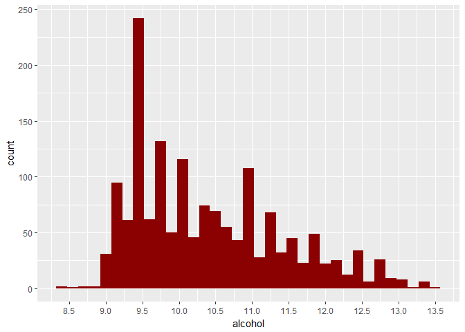<!-- -->

These plots just illustrate what we found out so far. The overlaying box plots represent the bins (best, average and worst wines) created beforehand. I've omitted the legends to reduce clutter as they are not necessary with the quality printed on the bottom of each plot.

<!-- -->

Breaking up the groups, we can see a nice and somewhat linear positive relationship between Quality and Citric Acid, and Quality and Sulphates. Fixed Acidity increases up until Quality = 7, then the median drops slightly, but the interquartile range (IQR) is bigger. Alcohol levels do not increase before we reach Quality = 6, meaning that even the most positively correlated variable can't save a really bad wine!
  
#### Negative 
  
* Volatile Acidity, Total Sulfur Dioxide, Density and Chlorides have a negative correlation. The worst thing for a wine is Volatile Acidity as previously stated. This time the results are different from the previous analysis, so I'll investigate the variable found to have a negative effect before, pH, afterwards. The order of the plots is from the most negatively correlated to the least:

<!-- -->
    
The outliers in the Total Sulfur Dioxide and Chlorides variables makes the plots really hard to interpret, removing values exceeding 200 and 0.2, respectively, helps:

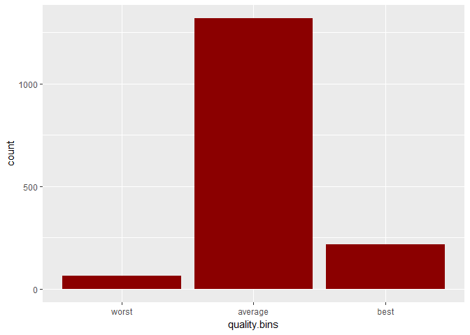<!-- -->

With the exception of Volatile Acidity, it doesn't appear to be a linear relationship between these variables and quality, maybe breaking up the groups helps (I'll keep the limits for Total Sulfur Dioxide and Chlorides):


<!-- -->

The variables have a negative, mostly linear relationship with quality, except Total Sulfur Dioxide, that similarly to what occurred with Alcohol, have a strange behavior up until a threshold, in this case, Quality = 5, so having low levels of SO2 can't save a bad wine. Now, the strange case, pH:

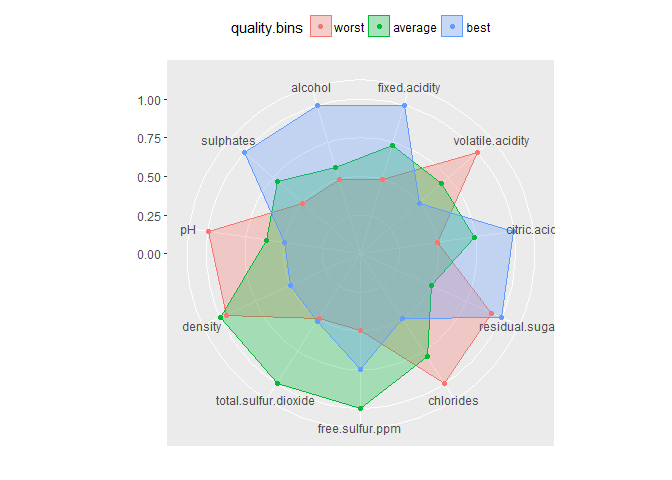<!-- -->

Even without a meaningful correlation score, it's evident that higher pH has a negative impact on quality.

#### Undetermined

Here we will take a look at the variables that have yet to exhibit a meaningful relationship with quality: Residual Sugar and Free Sulfur Dioxide (ppm).

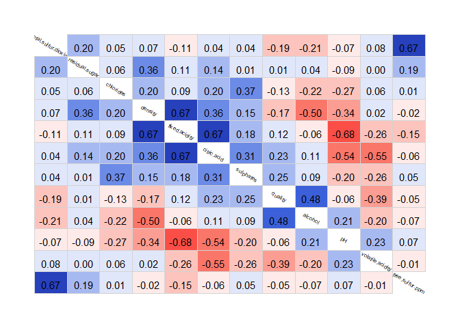<!-- -->

I've scaled the Y axis logaritimically (log10) as the values of Residual Sugar have a great range, but the many of the highest ones can be considered outliers. As expected, there's no meaningful relationship between it and Quality, the values are all over the place.

<!-- -->

Even though we didn't find an relationship between Free Sulfur Dioxide and Quality up until now, these plots explain why. Having "low" amounts of free SO2 is good for the very best wines, but the ones that are not that great actually benefit from having the antioxidant and antibacterial effects of SO2. The information found in the documentation about concentrations above 50 ppm of free SO2 becoming evident in the smell and taste of wine doesn't appear to pay off until we're studying the very best wines (quality = 8).

***

# Bivariate Analysis

### Talk about some of the relationships you observed in this part of the investigation. How did the feature(s) of interest vary with other features in the dataset?

The most correlated variables with quality are Alcohol (positively) and Volatile Acidity (negatively), but as far as correlation (Pearson's) values go, the relationship could be called moderate at best. According with the r^2 statistic, they explain the variation in the quality by 23.04% and 15.21% respectively. Most variables exhibit a weak correlation with quality or none at all.


But still, we can further expand the classification of the variables the variables (now in order of strength of relationship):

* Positive effect - Variables that tend to increase the quality of the wines as they increase, to a limit of course (we will study the outliers later on).
    + Alcohol
    + Citric Acid
    + Sulphates
    + Fixed Acidity

* Negative effect - Variables that tend to have the opposite effect, decreasing the quality of the wine as they increase:
    + Volatile Acidity
    + Total Sulfur Dioxide *
    + Density
    + Chlorides
    + pH
    + Free Sulfur Dioxide * 
    
(*) Those variables have a strange relationship with quality until a threshold is met (quality = 5)

* Undetermined effect - Variables that doesn't appear to affect the quality:
    + Residual Sugar


### Did you observe any interesting relationships between the other features (not the main feature(s) of interest)?

Yes. Here's some observations found analyzing the correlation diagram, as these are more complex relationships, I'll be taking a look at them in the next part of this analysis:

* Unsurprisingly, the most correlated variables in the dataset are pH and Fixed Acidity (-0.68) as pH is a scale to measure the overall acidity of liquids. pH is also moderately correlated with citric acid (-0.54). The surprise here is that Volatile Acidity have an small positive effect on pH.

* According to the documentation that came with the dataset, Density should be strongly affected by Alcohol and Residual Sugar. While the first do present an expected "high" negative correlation (for the dataset, it's more like moderate as far as correlations go), Sugar exhibit a weaker relationship to Density (0.36, along with Citric Acid) than Fixed Acidity (0.67). This last variable actually has the strongest relationship with Density in the dataset.

* Another expected "high" correlated relationship is Total Sulfur Dioxide and Free Sulfur Dioxide (0.67).

* One surprising result is that Volatile Acidity is negatively correlated with Citric Acid (-0.55) and Fixed Acidity (-0.26). What is not surprising is that it has the biggest negative effect on Quality (-0.39) of all the variables, nobody likes wine that tastes like vinegar!

* A strange result is that Sulphates doesn't appear to be correlated with Total (0.04) and Free Sulfur Dioxide (0.05), as whole point of having it, it is an additive, is to increase the SO2 levels. One possible explanation for this is that Sulphates are only added to wines with poor naturally occurring levels of SO2, that would explain why Sulphates have a positive effect on Quality (0.25) too.


### What was the strongest relationship you found?

As stated in the previous question, pH and Fixed Acidity have the strongest relationship in the dataset.
Here's the top 5 most correlated variables:

1. pH and Fixed Acidity (-0.68)
2. Fixed Acidity and Density (0.67), Fixed Acidity and Citric Acid (0.67), Free and Total Sulfur Dioxide (0.67)
5. Volatile Acidity and Citric Acid (-0.55)

When talking about the Quality, Alcohol has the strongest relationship (0.48), followed by Volatile Acidity (-0.39)

***

# Multivariate Plots Section

In this section, we'll expand the analysis and try to figure out the relationships between many variables, starting with one exploration I've been willing to do since the start, density:

### Density

Here's the correlation values between density and all the variables:


```
##        fixed.acidity          citric.acid       residual.sugar 
##                 0.67                 0.36                 0.36 
##            chlorides            sulphates total.sulfur.dioxide 
##                 0.20                 0.15                 0.07 
##     volatile.acidity      free.sulfur.ppm              quality 
##                 0.02                -0.02                -0.17 
##                   pH              alcohol 
##                -0.34                -0.50
```

The strongest relationships are between it and Fixed Acidity (0.67) and Alcohol (-0.50):

<!-- -->

The plot between them and density overlayed by a LOESS Regression illustrates the expected relationships.

The third most important variable is Residual Sugar(0.36):

<!-- -->

The relationship seems exponential until around Residual Sugar = 4, and noisy afterwards, so applying a log10 transformation in the X axis the plot becomes clearer (Plot 2).


Next we'd have Citric Acid (0.36) and pH (-0.34), but they are both highly correlated with Fixed Acidity, so they don't show us much new information.

<!-- -->

The study of pH and the variables that deal with acidity is next on the list.


Here's the best plot I could make to illustrate the relationship between Density and Fixed Acidity, Alcohol and Residual Sugar:

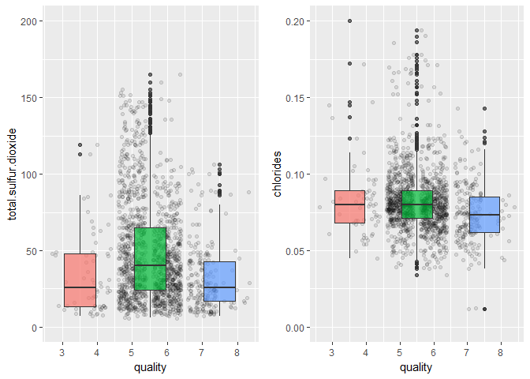<!-- -->

This plot shows the linear relationship between Fixed Acidity, the relationship is even more linear if we that the log10 of the X variable. The color of the dots represent the alcohol content, and the size, residual sugar, as the legends illustrates. There's a clear concentration of bigger dots at higher densities and higher alcohol content at lower ones.

### pH and acids

Again, let's start with the correlation values of pH:


```
##     volatile.acidity              alcohol      free.sulfur.ppm 
##                 0.23                 0.21                 0.07 
##              quality total.sulfur.dioxide       residual.sugar 
##                -0.06                -0.07                -0.09 
##            sulphates            chlorides              density 
##                -0.20                -0.27                -0.34 
##          citric.acid        fixed.acidity 
##                -0.54                -0.68
```

The two variables with the strongest relationship are Fixed Acidity (-0.68) and Citric Acid (-0.54):

<!-- -->

The problem here is that both these variables are strongly correlated with one another (0.67):

<!-- -->

Using them both doesn't bring much new information, but as this is a study of acidity, I should to use it. 


The next most correlated variable is density, even though we saw before that density is highly correlated with fixed acidity too, this variable can bring a lot of new information, mainly it's relationship with Alcohol and Residual Sugar, so it may be useful:

<!-- -->

There's a concentration of lower dense data points below the regression line, so this could be useful, but I'll keep only acid-related variables in the final plot.

The last variable worth looking into is the most curious one, and the reason I wanted to look into pH, Volatile Acidity (0.23), as one would expect it to have a negative relationship with pH, as lower pH means a more acidic content, but the correlation says it's the opposite effect:

<!-- -->

A very Small effect, but it's we can see that the points with the highest volatile acidity are located above the regression line.

Here's a curious plot illustrating all the acid-related variables:


```r
ggplot(data = data, aes(x = volatile.acidity, y = pH, size = fixed.acidity, 
                        color = citric.acid)) + 
  geom_point(alpha = 1) +
  scale_color_distiller(palette = 'Spectral', direction = -1) +
  scale_y_continuous(breaks = seq(0, 10, 0.1), trans = 'identity') +
  geom_smooth(method = 'loess')
```

<!-- -->

The coordinates and the regression shows us the weak, but curious, positive relationship between pH and Volatile Acidity. The size and color scale represent Fixed Acidity and Citric Acid respectively. A curiosity: the wines with the highest pH have both low Citric Acid and low Fixed Acidity, but the most acidic wine (pH ~ 2.74) has just a a moderate amount of Fixed Acidity, but the highest amount of Citric Acid in the dataset.

### Quality and everything else

As we've already explored the relationship between all variables and quality, we can go ahead and plot the most correlated variables with quality together:


```
##              alcohol            sulphates          citric.acid 
##                 0.48                 0.25                 0.23 
##        fixed.acidity       residual.sugar      free.sulfur.ppm 
##                 0.12                 0.01                -0.05 
##                   pH            chlorides              density 
##                -0.06                -0.13                -0.17 
## total.sulfur.dioxide     volatile.acidity 
##                -0.19                -0.39
```

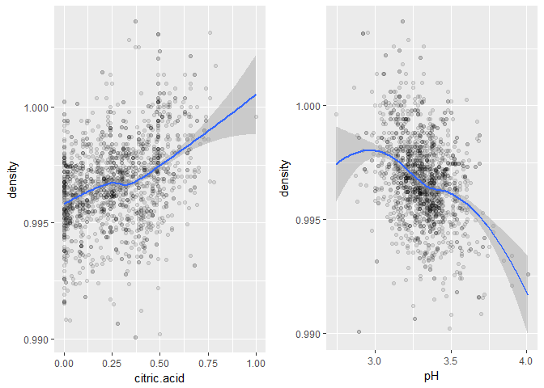<!-- -->

In this plot we can observe how the these variables affect quality, and there's some interesting new conclusions we can make:

* No good wine have a high value of Volatile Acidity.

* The wine with the most alcohol content is of quality 5, the other variables, Sulphates and Volatile Acidity, are within range of a much better wine. This illustrates that even with all this information, it's hard to predict the quality of a wine taking into account just the chemical composition.

This last point is the reason that using an linear model to estimate the quality ultimately fails:


```
## 
## Calls:
## m1: lm(formula = quality ~ alcohol, data = data)
## m2: lm(formula = quality ~ alcohol + volatile.acidity, data = data)
## m3: lm(formula = quality ~ alcohol + volatile.acidity + sulphates, 
##     data = data)
## m4: lm(formula = quality ~ alcohol + volatile.acidity + sulphates + 
##     citric.acid, data = data)
## m5: lm(formula = quality ~ alcohol + volatile.acidity + sulphates + 
##     citric.acid + total.sulfur.dioxide, data = data)
## m6: lm(formula = quality ~ alcohol + volatile.acidity + sulphates + 
##     citric.acid + total.sulfur.dioxide + density, data = data)
## m7: lm(formula = quality ~ alcohol + volatile.acidity + sulphates + 
##     citric.acid + total.sulfur.dioxide + density + chlorides, 
##     data = data)
## 
## =======================================================================================================
##                            m1         m2         m3         m4         m5          m6          m7      
## -------------------------------------------------------------------------------------------------------
##   (Intercept)            1.875***   3.095***   2.611***   2.646***   2.843***   -7.009      -0.953     
##                         (0.175)    (0.184)    (0.196)    (0.201)    (0.205)    (11.972)    (11.990)    
##   alcohol                0.361***   0.314***   0.309***   0.309***   0.295***    0.305***    0.280***  
##                         (0.017)    (0.016)    (0.016)    (0.016)    (0.016)     (0.020)     (0.020)    
##   volatile.acidity                 -1.384***  -1.221***  -1.265***  -1.222***   -1.247***   -1.114***  
##                                    (0.095)    (0.097)    (0.113)    (0.112)     (0.116)     (0.120)    
##   sulphates                                    0.679***   0.696***   0.721***    0.710***    0.903***  
##                                               (0.101)    (0.103)    (0.103)     (0.104)     (0.112)    
##   citric.acid                                            -0.079     -0.043      -0.093       0.044     
##                                                          (0.104)    (0.104)     (0.120)     (0.124)    
##   total.sulfur.dioxide                                              -0.002***   -0.002***   -0.002***  
##                                                                     (0.001)     (0.001)     (0.001)    
##   density                                                                        9.820       3.923     
##                                                                                (11.931)    (11.944)    
##   chlorides                                                                                 -1.747***  
##                                                                                             (0.406)    
## -------------------------------------------------------------------------------------------------------
##   R-squared                 0.227      0.317      0.336      0.336      0.344      0.344       0.352   
##   adj. R-squared            0.226      0.316      0.335      0.334      0.342      0.342       0.349   
##   sigma                     0.710      0.668      0.659      0.659      0.655      0.655       0.652   
##   F                       468.267    370.379    268.912    201.777    166.962    139.219     123.298   
##   p                         0.000      0.000      0.000      0.000      0.000      0.000       0.000   
##   Log-likelihood        -1721.057  -1621.814  -1599.384  -1599.093  -1589.749  -1589.409   -1580.138   
##   Deviance                805.870    711.796    692.105    691.852    683.814    683.523     675.643   
##   AIC                    3448.114   3251.628   3208.768   3210.186   3193.499   3194.818    3178.276   
##   BIC                    3464.245   3273.136   3235.654   3242.448   3231.138   3237.835    3226.670   
##   N                      1599       1599       1599       1599       1599       1599        1599       
## =======================================================================================================
```

The 7 most correlated variables just account for 35.2% of the quality rating.
Here's the regression line against a 3 fold cross validation:


<!-- -->

Trying to predict an ordered factor variable using a linear regression will never yields good results.


Using a classifier, instead, makes more sense, so we need to split the dataset into training and testing:


```
## [1] "Training set:"
```

```
## [1] 1200   14
```

```
## [1] "Testing set:"
```

```
## [1] 399  14
```


Here's the performance of a SVM classifier, using all the variables, already tuned:


```
## 
## Call:
## svm(formula = formula, data = train, kernel = "radial", type = "C-classification", 
##     cost = 4, gamma = 0.4)
## 
## 
## Parameters:
##    SVM-Type:  C-classification 
##  SVM-Kernel:  radial 
##        cost:  4 
##       gamma:  0.4 
## 
## Number of Support Vectors:  1042
```

```
## Accuracy: 67.41855 %
```

67.4% of accuracy is not that great, but still way better than random guess. A better way to analyse this model is using a confusion matrix and precision, recall and F1 scores:


```
##     predicted
## true   3   4   5   6   7   8
##    3   0   0   0   1   0   0
##    4   0   0  11   5   0   0
##    5   0   3 128  31   2   0
##    6   0   0  35 119   7   0
##    7   0   0   3  28  22   0
##    8   0   0   1   2   1   0
```

```
##   precision    recall        f1
## 3       NaN 0.0000000       NaN
## 4 0.0000000 0.0000000       NaN
## 5 0.7191011 0.7804878 0.7485380
## 6 0.6397849 0.7391304 0.6858790
## 7 0.6875000 0.4150943 0.5176471
## 8       NaN 0.0000000       NaN
```

At least no good wine was classified as bad, and no bad wine was classified as good. Most predictions were pretty close to what the real value was. 

If instead of trying to predict the exact score, we ask the model to predict if a wine is below or above average, a buy or not classification, we should buy only wines of above average quality, greater than 5:


```
## 
##  No Yes 
## 744 855
```

This way the dataset is split pretty evenly, a great characteristic for fitting machine leaning models.

<!-- -->

We should never buy wines with Volatile Acidity above 1.05, and the greater the alcohol content is, the more likely we are to buy it.

Now, the SVM classifier:


```
## 
## Call:
## svm(formula = formula, data = train, kernel = "radial", type = "C-classification", 
##     cost = 10, gamma = 0.6)
## 
## 
## Parameters:
##    SVM-Type:  C-classification 
##  SVM-Kernel:  radial 
##        cost:  10 
##       gamma:  0.6 
## 
## Number of Support Vectors:  886
```

```
## Accuracy: 81.95489 %
```

```
##      predicted
## true   No Yes
##   No  142  39
##   Yes  33 185
```

```
##     precision    recall        f1
## No  0.8114286 0.7845304 0.7977528
## Yes 0.8258929 0.8486239 0.8371041
```

This classifier can recommend if you should buy the wine or not with over 80% precision, a pretty cool end result for this analysis!

*** 

# Multivariate Analysis

### Talk about some of the relationships you observed in this part of the investigation. Were there features that strengthened each other in terms of looking at your feature(s) of interest?

As I had already explored in depth the relationship between each variable and quality, I chose to focus on the relationship between them in this section.

The study of density illustrated why it had a negative impact on quality, it was negatively correlated with the two main positive variables when talking about quality, alcohol and citric acid.

I've studied the relationship of pH and the acid related variables in the dataset too. This analysis found an interesting counter intuitive positive correlation between it and volatile acidity. As expected, the other acidic variables (fixed acidity and volatile acidity) had a negative effect on the pH value. Density had a negative effect too, but it can be explained when we look into the study of it, fixed acidity, the most negatively correlated variable with pH, is the of the most positively correlated variables with density, so no surprises here.

In this section I explored the most correlated variables to quality together, creating a plot to illustrate this, with these findings, I proceeded into the creation of predictive models to find out if it would be possible to mathematically predict quality based on the available variables. More on that in the final question's answer.

### Were there any interesting or surprising interactions between features?

Intuition led me to believe that Volatile Acidity, the amount of acetic acid (vinegar taste), would have a negative correlation with pH, as the pH of this acid is 2.4 and all the wines have a value above it. But that was not the case, they were positively correlated, albeit only slightly, which is a strange behavior that I cannot explain.

### OPTIONAL: Did you create any models with your dataset? Discuss the strengths and limitations of your model.

Yes, the linear model was created from the most important dependent variable, alcohol, it accounted for 22.7 % of the variance in quality. Adding volatile acidity helped the model to explain over 30% of the variance (r^2 = 0.317), but adding even more variables had a diminishing return after the third one, sulphates (r^2 = 0.336). The final model, with 7 variables only accounted for 35.2% of the variance in quality.

Obviously, as quality, while a numeric in nature, is an ordered factor with fixed integer values, a linear regression is not the best model to predict its value. So I created a SVM classifier. Using all the available variables in the dataset, it was able to reach 67.4 % of accuracy, but an analysis of the precision, recall and F1 scores clarified why: Most of the wines are of 5 or 6 quality, so predicting those values would ensure an acceptable level of accuracy, even for a poor model.

Expanding on these findings, I chose to create yet another output variable, as using the previously created quality.bins would have the same issues explained in the previous paragraph. The new variable called 'buy' has 2 possible values, Yes for wines of quality 6 and above and No for 5 and below. The almost even distributions of the data points between these values ensures that the accuracy score of the model would not benefit from the tall normal distribution of quality (most wines are average, quality = 5 or 6).

The end result was satisfactory, as the model was able to predict correctly in 82% of the cases, which let to me conclude that while the chemical composition can't be used to predict an exact value for the quality of a wine, it does have a pronounced effect. Better wines have a different composition that worse ones.

This conclusion inspired me to the build the third plot below, where we can see the difference in composition of the best (quality = 7 and 8) and the worst wines (quality = 3 and 4).

***

# Final Plots and Summary

### Plot one

<!-- -->


### Description One

Quality is normally distributed, most wines have a score of 5 or 6 (over 625 wines each) and are grouped together in the green group. There's fewer 'worst' (red) wines than 'best' (blue).

This plot helps the general public to familiarize themselves with the Quality Groups and the distribution of quality, making the other plots easier to understand.

### Plot Two

<!-- -->

### Description Two

The radar plot of the means of each variable (scaled between 0.5 and 1), separated by the quality groups helps to visually identify the profile of the different Quality Groups:

* Positive effect - Variables that tend to increase the quality of the wines as they increase:
    + Fixed Acidity
    + Citric Acid
    + Sulphates
    + Alcohol
    
* Negative effect - Variables that tend to have the opposite effect, decreasing the quality of the wine as they increase:
    + Volatile Acidity
    + Chlorides
    + pH
    
* Undetermined effect - Variables with a more complicated relationship:
    + Residual Sugar
    + Free Sulfur Dioxide (ppm)
    + Total Sulfur Dioxide
    + Density
    
Even losing dimensionality information, this plot was a key first step into understanding the relationship between each variable and quality.

### Plot Three

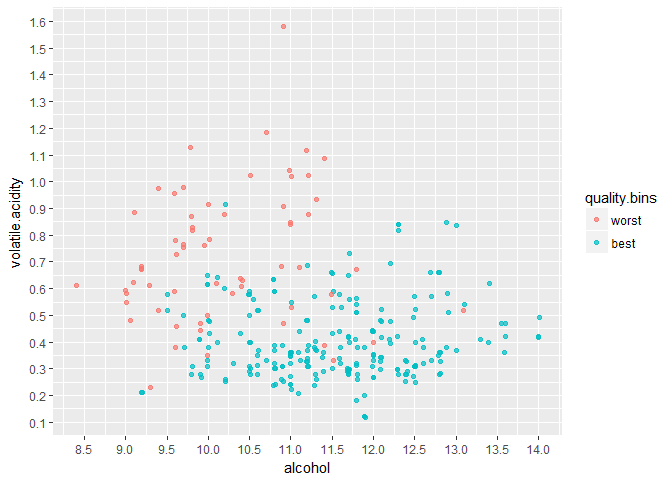<!-- -->

### Description Three

The three variables that better explain wine quality in this dataset are, from most important to the least:

* *Alcohol Content*: The variable with the most positive effect on quality (Correlation = 0.48)
* *Volatile Acidity*: The opposite of Alcohol, this variable has the most negative effect (Correlation = -0.39)
* *Sulphates*: This is an additive used on the production of the wines to make sure it has a healthy level of sulfur dioxide (SO2), this is important because it has antioxidant and antimicrobial proprieties (Correlation = 0.25)

In this plot, all average wines are omitted to emphasize the difference of composition between the worst and the best wines in the dataset. There's no good wine with over 1.0 g/L of volatile acidity, and very few bad wines with over 11.5% alcohol. The effect of the addition of sulphates is less clear, but looking closely it's possible to conclude that a good wine needs at least some of this additive.

# Reflection

With 1599 different wines, this was a great dataset to explore. In the begging of the exploration, I took a look at each variable to better understand its distribution, most variables were normally distributed, with a few exceptions. Still in the first part of the analysis, I chose to separate the data points into 3 bins hoping to easily identify the relationship of the variables. The trends identified helped shape the second section of the exploration.

In the second part I took an in depth look at the relationship between each variable and quality. Using the correlation score, some previous findings were confirmed, while a few remained a mystery. Potting box plots of each one of them against quality and breaking up the groups I created previously helped to precisely understand how and how much each of them affected the quality score. In this section I learned that there were data points all over the place, no nice and linear relationship could be found, so a linear model to predict quality would be pretty hard to implement.

The last part was all about how one variable could influence another, not only quality. I studied how the density and the pH were affected by the other variables, this helped better understand why density had a complicated relationship with quality. The study of pH, while unrelated with the objective of this project, showed the most curious relationship found in this dataset, the one between it and volatile acidity.

Returning to the main objective, I plotted the relationship between quality and the variables that had the greatest effect on it together and tried to create a linear model maybe would help to predict it. It failed. The reason for it became evident once I plotted the result of a cross validation: using a simple linear regression to predict an ordered factor is not a good practice and the dataset has a huge concentration of average wines, so any classification model would benefit from a highly inflated accuracy score, while precision and recall scores suffered. 

I created an SVM classifier to illustrate this last point. And, finally, created a model that yielded good results. I had to split the dataset once again, but this time between above and below average, and using the available variables, it could predict which group the wine belonged with 82% accuracy! This illustrates that while chemical composition is not a great way guess the precise quality of a wine, it does have an pronounced and real effect on it.

Limitations of this analysis are the facts that the quality scores are a bit subjective, even using a median of at least 3 scores given by experts, it's not a concrete value, like price, for example, and that all the data was from only just one winery. This last point is open to debate as fixing an independent variable (winery) helps to reduce variability, but not having another dataset, from other winery, leaves a question: do theses results apply to any winery, or specifically to this one? An idea for another project!

# References

* ggRadar https://www.rdocumentation.org/packages/ggiraphExtra/versions/0.1.0/topics/ggRadar
* Corrgram https://stackoverflow.com/questions/19012529/correlation-corrplot-configuration
* Regression analysis http://www.statmethods.net/stats/regression.html
* e1071 package (SVM) https://cran.r-project.org/web/packages/e1071/e1071.pdf
